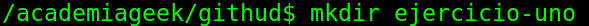

# Ejercicios Módulo 0
Despues de haber descargado todos mi entorno de desarrollo procedo ha realizar los siguientes pasos:

# Configurarando el Git desde la terminal
Configuramos con los comandos:
 '''git config user.name "thunder609"'''
 '''git   config  user.mail thunder609@academiagit.com'''

# Creacion de Directorios y archivos del aplicativo
    Pasos para crear carpetas en mi directorio Documentos por consola
1. /AcademiaGeek-ejercicio-uno$ mkdir AcademiaGeek-ejercicio-uno.

2.  buscar la carpeta de trabajo por la terminal con el comando `cd`  /AcademiaGeek-ejercicio-uno$ cd AcademiaGeek-ejercicio-uno.

3. Estando en la carpeta ejercicio-uno crear un archivo con el nombre index.html y otro README.md con la siguiente estructura
touch index.html README.md

```html 
<!DOCTYPE html>
<html lang="en">
<head>
    <meta charset="UTF-8">
    <meta http-equiv="X-UA-Compatible" content="IE=edge">
    <meta name="viewport" content="width=device-width, initial-scale=1.0">
    <title>Document</title>
</head>
<body>
    <H1> prueba</H1>
    <p>Lorem ipsum dolor sit amet consectetur adipisicing elit. Odio, quae iure? Adipisci saepe voluptatibus dolorum! Excepturi, quam voluptate voluptatem quibusdam rerum eum, odit soluta necessitatibus animi, vel tenetur dolorum laudantium?
        
    </p>
</body>
/html
```
4. Crear un archivo README.md con la descripción de los conceptos aprendido en esta sesión
5. Hacer un `git status` de los cambios realizados
AcademiaGeek-ejercicio-uno$ git status 
En la rama master
Archivos sin seguimiento:
  (usa "git add <archivo>..." para incluirlo a lo que se será confirmado)

        README.MD
7. Agregar los archivos con `git add .` los archivos modificados

8. Verificar los archivos adicionados con `git status`
9. Hacer un commit: ``` git commit -m "Ejercicios Git" ```
10. Crear un repositorio en gitHub
11. Agregar la url del repositorio remoto
12. terminar con `git push` para entregar los cambios a la respectiva rama.

## Entrega de la tarea

Para realizar la entrega de esta actividad debe realizar los siguientes pasos:

    1. Crear un Issues llamado Entrega-Modulo-0-01-primeros-pasos-Tarea-01
    2. Al Issues adicionar un pantallazo con el enunciado de la tarea
    3. Luego debes agregar la descripción de los pasos que ejecutaste para dar solución a la tarea y adjuntar las imágenes de evidencia.